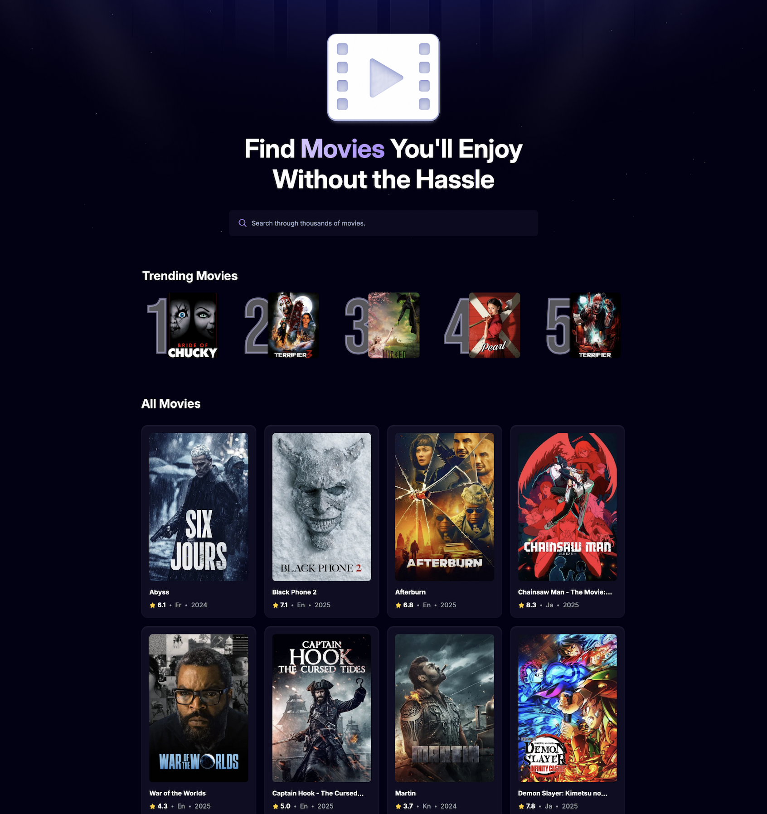

# Movie Finder App
A movie discovery web app built with React, the TMDB API, and Tailwind CSS. It uses Appwrite as a backend to track and rank user search queries for a "Trending" section.

The app allows users to browse popular titles, search for movies in real-time, and see which movies are being searched for most by other users.

## Features
- Browse popular movies
- Search with debounced input
- View poster, rating, language, and release year
- Trending section ranks exact-match searches
- Responsive UI with Tailwind CSS
- Loading indicators and error handling

## Tech Stack
- React
- Tailwind CSS
- TMDB API
- Appwrite
- Vite

## Installation
### 1. Clone the Repository
```bash
git clone https://github.com/eatyeo/movie-app.git
cd movie-app
```

### 2. Install Dependencies
```bash
npm install
```

### 3. Add Your TMDB API Key
Create a `.env` file in the root of the project and add:
```bash
VITE_TMDB_API_KEY=YOUR_TMDB_READ_ACCESS_TOKEN
VITE_APPWRITE_ENDPOINT=YOUR_APPWRITE_ENDPOINT
VITE_APPWRITE_PROJECT_ID=YOUR_APPWRITE_PROJECT_ID
VITE_APPWRITE_DATABASE_ID=YOUR_APPWRITE_DATABASE_ID
VITE_APPWRITE_TABLE_ID=YOUR_APPWRITE_TABLE_ID
```
- Use the TMDB Read Access Token (Bearer token), not the simple API key.
- Get it from: https://www.themoviedb.org/settings/api

### 4. Run the Development Server
```bash
npm run dev
```
- Open in your browser: `http://localhost:<your-port>`

## Preview


## Acknowledgements
- Movie data provided by The Movie Database (TMDB) — https://www.themoviedb.org/